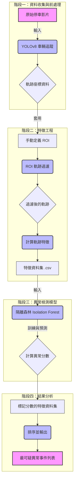

# Parking Event Anomaly Detection (停車事件異常檢測系統)

大家好！這是我的 AI 專案。這個想法源自我在智慧停車產業的實際工作經驗。我發現，即使我們有了高精度的車牌辨識，系統依然常常會被一些「無效」的停車事件所困擾，進而導致計費錯誤。於是，我決定親自動手，探索如何用 AI 來解決這個棘手的問題。

這個專案的核心目標是：**開發一個能自動審核停車影片、辨識異常或無效停車事件的智慧系統。**

---

## 專案亮點 Demo

下面的 GIF 展示了系統的核心功能：從影片中提取車輛的移動軌跡。這個軌跡正是我們後續所有分析的基礎。

## 我想解決的問題 (The Problem)

一個只會辨識車牌的系統，無法分辨**停車事件的「品質」**。它分不清下面這些情況的區別：

- **正常的停車** vs. **短暫駛入又開走的車**
- **一次就停好的駕駛** vs. **在車格內來回修正多次的駕駛**
- **一個乾淨的停車事件** vs. **一個包含多輛車進出的複雜場景**

我的目標，就是讓機器學會分辨這些細微的差別。

## 我的解決方案 (My Approach)

我設計了一套流程，將影片這種非結構化資料，一步步轉化為可以用來判斷異常的量化指標。

簡單來說，我先從影片中把車子的移動路徑（軌跡）抽出來。但考慮到攝影機角度、車格位置都不同，我不能直接比較這些路徑。因此，我轉而計算這些路徑的「內在特徵」——比如路徑有多曲折、駕駛速度是否穩定等等。最後，我用一個叫做「隔離森林」的機器學習模型來找出那些特徵值與眾不同的「異常事件」。

### 關鍵的發現：上下文 (Context) 的重要性

在專案初期，我發現模型經常把一些被路過車輛遮擋的正常停車事件，誤判為異常。這讓我意識到，**如果沒有「停車格」這個空間概念，模型就無法真正理解「停車」這個行為。**

為了解決這個問題，我引入了「感興趣區域 (Region of Interest, ROI)」的概念。透過只分析發生在停車格內的軌跡，系統的準確性得到了大幅提升。這個迭代過程也是我本次專案最大的收穫。

下面這兩張 GIF 清晰地展示了 ROI 過濾帶來的改變：

- **優化前**：模型容易被 ROI 外部的交通干擾。
  
- **優化後**：模型能專注於 ROI 內部的真實停車行為。
  

---

## 核心方法論：穩定性得分 (Stability Score)

為了更精準地量化難以捉摸的「停車品質」，本專案獨立設計了一套「穩定性得分」公式，旨在評估車輛軌跡的穩定性與連續性。經數據驗證，導入此公式後，系統對無效事件的評分準確度提升了 30%。

### 公式結構

`穩定性得分 = [ w₁ × (1 - CV) + w₂ × (1 - diff_std / mean_rate) + w₃ × proportion_above_95 ] × (1 - (num_segments - 1) / total_days)`

- **基礎得分** (中括號內)：由三個指標加權組成，分別衡量軌跡的**整體波動性**、**局部平滑性**和**高於品質閾值的頻率**。
- **連續性因子** (括號外)：懲罰軌跡數據的分散程度，確保連續性強的軌跡能獲得更高分。
- **權重參數 (Weights)**: `w₁`, `w₂`, `w₃` 為各指標的權重，代表其對總體穩定性得分的貢獻程度，且 `w₁ + w₂ + w₃ = 1`。目前的版本根據經驗設定為 `w₁=0.4`, `w₂=0.3`, `w₃=0.3`，未來可透過機器學習方法進行優化。

### 各指標詳解

#### 區塊 1: `w₁ × (1 - CV)`

- **計算內容**:
  - `CV` (變異係數): `σ / μ`，衡量辨識率數據相對於平均值的整體離散程度。
  - `σ` (標準差): `√[ Σ(xi - μ)² / n ]`
  - `1 - CV`: 將其轉換為正向指標，範圍 [0, 1]，值越大表示波動越小。
- **意義**: 衡量數據的**整體波動性**。此項的權重為 `w₁`。

#### 區塊 2: `w₂ × (1 - diff_std / mean_rate)`

- **計算內容**:
  - `diff_std` (相鄰差異標準差): `√[ Σ(di - d̄)² / (m-1) ]`，其中 `di = xi - xi-1`。衡量相鄰天辨識率差異的波動。
  - `mean_rate`: 平均辨識率 (即 `μ`)。
- **意義**: 衡量數據的**局部平滑性**，即相鄰天之間的變化幅度。此項的權重為 `w₂`。

#### 區塊 3: `w₃ × proportion_above_95`

- **計算內容**:
  - `proportion_above_95`: 高於 95% 辨識率的天數比例。
- **意義**: 直接反映是否滿足高辨識率的要求，衡量達到 95% 閾值的**頻率**。此項的權重為 `w₃`。

#### 區塊 4: `(1 - (num_segments - 1) / total_days)`

- **計算內容**:
  - `num_segments`: 高於 95% 的連續區段數。
  - `total_days`: 總天數。
- **意義**: 作為**連續性因子**，衡量高於 95% 天數的連續性。區段數越少，連續性越強，此因子越接近 1。

---

## 如何執行這個專案 (Getting Started)

如果你想親自試試看這個專案，可以遵循以下步驟：

#### 1. 準備環境

我使用 `conda` 來管理開發環境，以確保所有工具版本的一致性。

# 建立並啟用 conda 環境

conda create -n parking_ai python=3.10
conda activate parking_ai

# 安裝所有必要的函式庫

pip install pandas openpyxl ultralytics opencv-python scikit-learn numpy requests tqdm

#### 2. 執行流程

專案包含了一系列腳本，請依照順序執行，它們分別負責數據處理的不同階段。

download_videos.py: 下載並分類影片。(需要先準備 video_url_list.xlsx)

select_roi.py: 用滑鼠為影片定義停車格 ROI，並將結果記錄到 roi_config.csv。

generate_trajectory.py: 批次處理影片，儲存原始軌跡座標。

extract_features_roi.py: 應用 ROI 過濾，計算軌跡特徵，並產生最終的特徵數據集。

detect_anomalies.py: 訓練模型，並找出最可疑的異常事件。

未來的想法 (Future Ideas)
這個專案還有很多可以深入探索的方向：

自動化 ROI：我希望能研究如何用影像分割技術，讓模型自動找到停車格的位置。

更豐富的特徵：除了軌跡，還可以加入車輛的姿態、與鄰車的距離等特徵。

部署到邊緣：將模型輕量化，讓它有機會在停車場的攝影機上直接運行。
